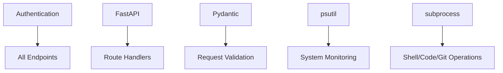
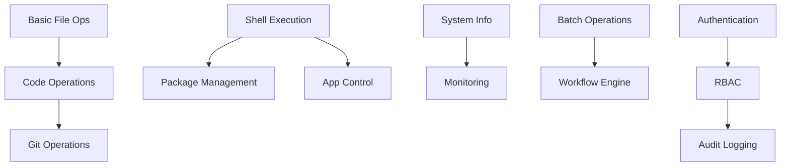

# 📋 Feature Inventory & Capability Matrix

## Current Features (✅ Implemented)

### 1. Core System Control

| Feature | Endpoint | Status | Capability Level | Security Level |
|---------|----------|--------|-----------------|----------------|
| **Shell Command Execution** | `/shell` | ✅ Complete | **Advanced** | ⚠️ High Risk |
| **File System Operations** | `/files` | ✅ Complete | **Advanced** | 🔒 Medium Risk |
| **Code Execution & Analysis** | `/code` | ✅ Complete | **Advanced** | ⚠️ High Risk |
| **System Information** | `/system` | ✅ Complete | **Basic** | ✅ Low Risk |
| **Real-time Monitoring** | `/monitor` | ✅ Complete | **Intermediate** | ✅ Low Risk |

### 2. Development & DevOps

| Feature | Endpoint | Status | Capability Level | Languages Supported |
|---------|----------|--------|-----------------|-------------------|
| **Git Version Control** | `/git` | ✅ Complete | **Advanced** | All Git Commands |
| **Package Management** | `/package` | ✅ Complete | **Advanced** | pip, npm, apt, brew, winget, pacman |
| **Code Refactoring** | `/refactor` | ✅ Complete | **Intermediate** | Text-based (any language) |
| **Batch Operations** | `/batch` | ✅ Basic | **Basic** | Shell commands only |
| **Application Control** | `/apps` | ✅ Complete | **Intermediate** | Platform-specific launchers |

### 3. AI Integration Features

| Feature | Location | Status | Capability Level | Integration Status |
|---------|----------|--------|-----------------|-------------------|
| **OpenAI Assistant Creation** | `/assistants/create_assistant.py` | ✅ Complete | **Advanced** | Direct API integration |
| **Thread Management** | `/assistants/thread_ops.py` | ✅ Complete | **Advanced** | Full conversation handling |
| **Tool File Operations** | `/assistants/tool_file_ops.py` | ✅ Complete | **Intermediate** | Assistant file management |
| **View Operations** | `/assistants/view_ops.py` | ✅ Complete | **Basic** | Assistant inspection |
| **Delete Operations** | `/assistants/delete_ops.py` | ✅ Complete | **Basic** | Cleanup operations |
| **Advanced Operations** | `/assistants/advanced_ops.py` | ✅ Complete | **Advanced** | Complex assistant workflows |

## Planned Features (🚧 In Development / 📋 Planned)

### 1. Enhanced Security & Authentication

| Feature | Priority | Timeline | Impact | Description |
|---------|----------|----------|--------|-------------|
| **Role-Based Access Control (RBAC)** | 🔴 Critical | Q1 2025 | High | User roles with specific permissions |
| **JWT Token Authentication** | 🟡 Medium | Q1 2025 | Medium | Session-based authentication |
| **API Rate Limiting** | 🔴 Critical | Q1 2025 | High | Prevent abuse and DoS attacks |
| **Audit Logging** | 🔴 Critical | Q1 2025 | High | Complete operation tracking |
| **Command Sandboxing** | 🔴 Critical | Q1 2025 | High | Isolated execution environments |
| **IP Whitelisting** | 🟡 Medium | Q2 2025 | Medium | Network-based access control |

### 2. Advanced System Capabilities

| Feature | Priority | Timeline | Impact | Description |
|---------|----------|----------|--------|-------------|
| **Container Management** | 🔴 Critical | Q1 2025 | High | Docker/Podman integration |
| **Service Management** | 🔴 Critical | Q1 2025 | High | systemd/Windows services control |
| **Network Operations** | 🟡 Medium | Q2 2025 | Medium | Advanced networking tools |
| **Database Operations** | 🟡 Medium | Q1 2025 | Medium | SQL/NoSQL database management |
| **Backup & Recovery** | 🟢 Low | Q2 2025 | Medium | Automated backup systems |
| **System Configuration** | 🟡 Medium | Q2 2025 | Medium | OS-level settings management |

### 3. AI Agent Enhancements

| Feature | Priority | Timeline | Impact | Description |
|---------|----------|----------|--------|-------------|
| **Multi-Agent Coordination** | 🔴 Critical | Q1 2025 | High | Multiple agents working together |
| **Learning & Adaptation** | 🔴 Critical | Q2 2025 | High | Self-improving agent capabilities |
| **Natural Language Interface** | 🟡 Medium | Q1 2025 | High | Convert human speech to API calls |
| **Error Recovery & Retry** | 🟡 Medium | Q1 2025 | Medium | Intelligent failure handling |
| **Task Planning & Orchestration** | 🔴 Critical | Q2 2025 | High | Complex multi-step task execution |
| **Context Awareness** | 🟡 Medium | Q2 2025 | Medium | Understanding system state and history |

### 4. Enterprise Integration

| Feature | Priority | Timeline | Impact | Description |
|---------|----------|----------|--------|-------------|
| **Cloud Platform Integration** | 🔴 Critical | Q2 2025 | High | AWS, Azure, GCP native operations |
| **Enterprise Authentication** | 🟡 Medium | Q2 2025 | Medium | LDAP, SAML, Active Directory |
| **API Gateway Integration** | 🟡 Medium | Q2 2025 | Medium | Kong, Nginx, AWS API Gateway |
| **Monitoring & Alerting** | 🔴 Critical | Q1 2025 | High | Prometheus, Grafana integration |
| **Configuration Management** | 🟡 Medium | Q2 2025 | Medium | Ansible, Terraform integration |
| **Secret Management** | 🔴 Critical | Q1 2025 | High | HashiCorp Vault, AWS Secrets Manager |

### 5. Developer Experience

| Feature | Priority | Timeline | Impact | Description |
|---------|----------|----------|--------|-------------|
| **SDK Development** | 🔴 Critical | Q1 2025 | High | Python, JavaScript, Go SDKs |
| **CLI Tool** | 🟡 Medium | Q1 2025 | Medium | Command-line interface for API |
| **Web Dashboard** | 🟡 Medium | Q2 2025 | Medium | Web-based management interface |
| **Plugin System** | 🟡 Medium | Q2 2025 | High | Extensible plugin architecture |
| **Template System** | 🟢 Low | Q2 2025 | Medium | Pre-built operation templates |
| **Testing Framework** | 🔴 Critical | Q1 2025 | High | Comprehensive testing tools |

## Feature Capability Matrix

### Current Implementation Completeness

| Category | Basic (30%) | Intermediate (60%) | Advanced (90%) | Expert (100%) |
|----------|-------------|-------------------|----------------|---------------|
| **File Operations** | ✅ | ✅ | ✅ | 🚧 ACL Support |
| **Shell Execution** | ✅ | ✅ | ✅ | 🚧 Sandboxing |
| **Code Operations** | ✅ | ✅ | 🚧 Multi-lang | 📋 IDE Integration |
| **Git Integration** | ✅ | ✅ | ✅ | 📋 GitHub API |
| **System Monitoring** | ✅ | ✅ | 🚧 Alerting | 📋 ML Analytics |
| **Package Management** | ✅ | ✅ | ✅ | 📋 Dependency Resolution |
| **App Management** | ✅ | 🚧 Service Control | 📋 GUI Automation | 📋 Remote Desktop |
| **Authentication** | ✅ | 🚧 JWT | 📋 RBAC | 📋 SSO |
| **Batch Operations** | ✅ | 🚧 Dependencies | 📋 Workflows | 📋 Visual Editor |
| **AI Integration** | ✅ | ✅ | 🚧 Multi-modal | 📋 AutoML |

### Language & Platform Support Matrix

#### Code Execution Support

| Language | Run | Test | Lint | Format | Debug | IDE Integration |
|----------|-----|------|------|--------|--------|----------------|
| **Python** | ✅ | ✅ pytest | ✅ flake8 | ✅ black | 📋 | 📋 |
| **JavaScript** | ✅ node | ✅ npm test | ✅ eslint | ✅ prettier | 📋 | 📋 |
| **TypeScript** | 📋 | 📋 jest | 📋 tslint | 📋 prettier | 📋 | 📋 |
| **Bash/Shell** | ✅ | 🚧 shellcheck | 🚧 shellcheck | 📋 | 📋 | 📋 |
| **Go** | 📋 | 📋 go test | 📋 golint | 📋 gofmt | 📋 | 📋 |
| **Rust** | 📋 | 📋 cargo test | 📋 clippy | 📋 rustfmt | 📋 | 📋 |
| **Java** | 📋 | 📋 junit | 📋 checkstyle | 📋 | 📋 | 📋 |
| **C/C++** | 📋 | 📋 | 📋 cppcheck | 📋 clang-format | 📋 | 📋 |

#### Package Manager Support

| Platform | Package Manager | Install | Remove | Update | List | Search |
|----------|----------------|---------|--------|--------|------|--------|
| **Python** | pip | ✅ | ✅ | ✅ | ✅ | 📋 |
| **JavaScript** | npm | ✅ | ✅ | ✅ | ✅ | 📋 |
| **JavaScript** | yarn | 📋 | 📋 | 📋 | 📋 | 📋 |
| **Ubuntu/Debian** | apt | ✅ | ✅ | ✅ | ✅ | 📋 |
| **Arch Linux** | pacman | ✅ | ✅ | ✅ | ✅ | 📋 |
| **macOS** | brew | ✅ | ✅ | ✅ | ✅ | 📋 |
| **Windows** | winget | ✅ | ✅ | ✅ | ✅ | 📋 |
| **Windows** | chocolatey | 📋 | 📋 | 📋 | 📋 | 📋 |
| **CentOS/RHEL** | yum/dnf | 📋 | 📋 | 📋 | 📋 | 📋 |

#### Operating System Support

| OS Category | Specific OS | Shell Support | File Ops | App Control | Service Mgmt |
|-------------|-------------|---------------|----------|-------------|--------------|
| **Windows** | Windows 10/11 | ✅ PowerShell, CMD | ✅ | ✅ tasklist/kill | 🚧 |
| **Windows** | Windows Server | ✅ PowerShell | ✅ | ✅ | 📋 |
| **Linux** | Ubuntu/Debian | ✅ bash, zsh | ✅ | ✅ ps/kill | 🚧 systemd |
| **Linux** | CentOS/RHEL | ✅ bash | ✅ | ✅ | 📋 systemd |
| **Linux** | Arch Linux | ✅ bash, zsh | ✅ | ✅ | 📋 systemd |
| **macOS** | macOS 10.15+ | ✅ bash, zsh | ✅ | ✅ ps/kill | 📋 launchd |
| **Container** | Docker | ✅ sh/bash | ✅ | ✅ | 📋 |
| **Container** | Podman | 📋 | 📋 | 📋 | 📋 |

## Feature Dependency Map

### Core Dependencies

### Advanced Feature Dependencies

## Quality Metrics & Standards

### Current Quality Status

| Metric | Target | Current | Status |
|--------|--------|---------|--------|
| **Code Coverage** | 90% | ~60% | 🟡 Improving |
| **API Response Time** | <100ms | <50ms | ✅ Excellent |
| **Security Scan** | 0 Critical | 2 Critical | 🔴 Needs Work |
| **Documentation** | 100% | ~70% | 🟡 Good |
| **Error Handling** | 95% | ~80% | 🟡 Good |
| **Input Validation** | 100% | 95% | ✅ Excellent |

### Testing Strategy

| Test Type | Coverage | Tools | Status |
|-----------|----------|-------|--------|
| **Unit Tests** | Per module | pytest | 🚧 Partial |
| **Integration Tests** | API endpoints | pytest + requests | 🚧 Basic |
| **Performance Tests** | Load testing | locust | 📋 Planned |
| **Security Tests** | Vulnerability scanning | bandit, safety | 📋 Planned |
| **E2E Tests** | Full workflows | pytest + docker | 📋 Planned |

## Risk Assessment Matrix

### Current Risks

| Risk Category | Risk Level | Mitigation Status | Description |
|---------------|------------|------------------|-------------|
| **Shell Injection** | 🔴 Critical | 📋 Planned | Arbitrary command execution |
| **File System Access** | 🟡 Medium | 🚧 Partial | Unrestricted file operations |
| **Resource Exhaustion** | 🟡 Medium | 📋 Planned | No resource limits |
| **Authentication Bypass** | 🔴 Critical | 🚧 Basic | Simple API key only |
| **Data Exposure** | 🟡 Medium | 🚧 Basic | No encryption at rest |
| **Service Availability** | 🟡 Medium | 📋 Planned | No redundancy |

### Mitigation Roadmap

1. **Q1 2025 - Security Hardening**
   - Implement command sandboxing
   - Add rate limiting
   - Enhance authentication

2. **Q2 2025 - Enterprise Readiness**
   - Add monitoring and alerting
   - Implement backup and recovery
   - Add load balancing

3. **Q3 2025 - Advanced Features**
   - Multi-agent coordination
   - Intelligent automation
   - Predictive operations

---

**This feature inventory provides a comprehensive view of current capabilities and a clear roadmap for future development, ensuring the GPT Super-Agent API evolves into a production-ready, enterprise-grade system.**
