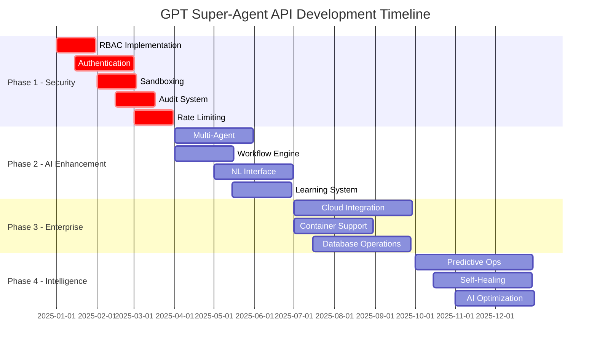

# 🗺️ Development Roadmap & Future Vision

## 🎯 Vision Statement

**Transform the GPT Super-Agent API into the definitive platform for AI-driven system automation, enabling autonomous agents to operate with human-level competence across all computing environments.**

## 📅 Development Timeline

### 🔴 Phase 1: Security & Stability (Q1 2025)
**Priority: Critical Infrastructure**

#### Security Hardening
- [ ] **Role-Based Access Control (RBAC)**
  - Multi-tenant user management
  - Granular permission system
  - API key scoping and restrictions
  - **Timeline:** January 2025

- [ ] **Advanced Authentication**
  - JWT token support with refresh
  - OAuth 2.0 integration
  - Multi-factor authentication (MFA)
  - **Timeline:** January 2025

- [ ] **Command Sandboxing**
  - Container-based execution isolation
  - Resource limits (CPU, memory, disk)
  - Network access controls
  - **Timeline:** February 2025

- [ ] **Audit & Logging System**
  - Complete operation tracking
  - Structured logging (JSON)
  - Log aggregation and analysis
  - **Timeline:** February 2025

- [ ] **Rate Limiting & DDoS Protection**
  - Per-user/IP rate limiting
  - Adaptive throttling
  - Request queuing system
  - **Timeline:** March 2025

#### Core Stability Improvements
- [ ] **Enhanced Error Handling**
  - Comprehensive exception management
  - Graceful degradation patterns
  - Recovery mechanisms
  - **Timeline:** January 2025

- [ ] **Input Validation & Sanitization**
  - Command injection prevention
  - Path traversal protection
  - Content filtering
  - **Timeline:** February 2025

- [ ] **Health Monitoring**
  - Endpoint health checks
  - System resource monitoring
  - Performance metrics collection
  - **Timeline:** March 2025

### 🟡 Phase 2: Advanced Agent Capabilities (Q2 2025)
**Priority: AI Enhancement**

#### Multi-Agent Coordination
- [ ] **Agent Communication Protocol**
  - Inter-agent messaging system
  - Task delegation framework
  - State synchronization
  - **Timeline:** April 2025

- [ ] **Distributed Task Execution**
  - Parallel operation handling
  - Load balancing across agents
  - Fault tolerance and recovery
  - **Timeline:** May 2025

- [ ] **Agent Learning & Adaptation**
  - Operation success tracking
  - Performance optimization
  - Behavioral pattern recognition
  - **Timeline:** June 2025

#### Enhanced Batch Operations
- [ ] **Workflow Engine**
  - Visual workflow designer
  - Conditional logic and branching
  - Error handling and rollback
  - **Timeline:** April 2025

- [ ] **Dependency Management**
  - Task dependency resolution
  - Parallel execution optimization
  - Resource conflict detection
  - **Timeline:** May 2025

- [ ] **Template System**
  - Pre-built operation templates
  - Parameterized workflows
  - Community template sharing
  - **Timeline:** June 2025

#### Natural Language Interface
- [ ] **Command Parser**
  - Natural language to API conversion
  - Intent recognition and classification
  - Context-aware interpretation
  - **Timeline:** May 2025

- [ ] **Conversational Interface**
  - Multi-turn conversation support
  - Context preservation
  - Clarification requests
  - **Timeline:** June 2025

### 🟢 Phase 3: Enterprise Integration (Q3 2025)
**Priority: Production Readiness**

#### Cloud Platform Integration
- [ ] **AWS Integration**
  - EC2, S3, Lambda operations
  - CloudFormation template management
  - IAM integration
  - **Timeline:** July 2025

- [ ] **Azure Integration**
  - Virtual machines and storage
  - Azure Functions integration
  - Active Directory support
  - **Timeline:** August 2025

- [ ] **Google Cloud Platform**
  - Compute Engine operations
  - Cloud Storage management
  - IAM and service accounts
  - **Timeline:** September 2025

#### Container & Orchestration
- [ ] **Docker Management**
  - Container lifecycle operations
  - Image building and deployment
  - Network and volume management
  - **Timeline:** July 2025

- [ ] **Kubernetes Integration**
  - Pod and service management
  - Deployment orchestration
  - Resource monitoring
  - **Timeline:** August 2025

- [ ] **Helm Chart Support**
  - Chart deployment and management
  - Release lifecycle operations
  - Value customization
  - **Timeline:** September 2025

#### Database Operations
- [ ] **SQL Database Support**
  - Query execution and management
  - Schema migration tools
  - Backup and restore operations
  - **Timeline:** July 2025

- [ ] **NoSQL Integration**
  - MongoDB, Redis operations
  - Document and key-value stores
  - Data migration tools
  - **Timeline:** August 2025

- [ ] **Database Performance Monitoring**
  - Query performance analysis
  - Index optimization suggestions
  - Capacity planning tools
  - **Timeline:** September 2025

### 🔵 Phase 4: Intelligent Automation (Q4 2025)
**Priority: AI-Driven Operations**

#### Predictive Operations
- [ ] **System Health Prediction**
  - Anomaly detection algorithms
  - Failure prediction models
  - Preventive maintenance scheduling
  - **Timeline:** October 2025

- [ ] **Resource Optimization**
  - Automated scaling decisions
  - Performance tuning recommendations
  - Cost optimization suggestions
  - **Timeline:** November 2025

- [ ] **Security Threat Detection**
  - Behavioral analysis
  - Threat intelligence integration
  - Automated response protocols
  - **Timeline:** December 2025

#### Self-Healing Systems
- [ ] **Automatic Problem Resolution**
  - Issue detection and diagnosis
  - Solution recommendation engine
  - Automated fix application
  - **Timeline:** October 2025

- [ ] **System Recovery Automation**
  - Backup and restore automation
  - Disaster recovery procedures
  - Service restoration protocols
  - **Timeline:** November 2025

- [ ] **Configuration Drift Detection**
  - Baseline configuration tracking
  - Unauthorized change detection
  - Compliance monitoring
  - **Timeline:** December 2025

## 🚀 Long-Term Vision (2026+)

### Advanced AI Integration
- **Machine Learning Operations (MLOps)**
  - Model training and deployment pipelines
  - A/B testing automation
  - Performance monitoring and retraining

- **Computer Vision Integration**
  - Desktop automation through image recognition
  - GUI testing and interaction
  - Visual monitoring and alerting

- **Natural Language Understanding**
  - Context-aware command interpretation
  - Multi-language support
  - Technical documentation generation

### Ecosystem Expansion
- **Plugin Architecture**
  - Third-party extension system
  - Marketplace for community plugins
  - SDK for custom integrations

- **Enterprise Integration Hub**
  - Salesforce, ServiceNow integration
  - ERP system connections
  - Business process automation

- **IoT and Edge Computing**
  - Edge device management
  - IoT sensor integration
  - Real-time data processing

## 📈 Feature Evolution Timeline



## 🔧 Technical Implementation Details

### Architecture Evolution

#### Current Architecture (2024)
```
FastAPI Monolith → Route Modules → System APIs
```

#### Target Architecture (2025)
```
API Gateway → Microservices → Container Runtime → Cloud APIs
```

#### Future Architecture (2026+)
```
AI Orchestrator → Agent Pool → Distributed Runtime → Multi-Cloud
```

### Technology Stack Evolution

#### Current Stack
- **Backend:** FastAPI, Python 3.13+
- **Authentication:** Simple API keys
- **Deployment:** Single instance, uvicorn
- **Storage:** File system only

#### Enhanced Stack (Q2 2025)
- **Backend:** FastAPI + Celery for async tasks
- **Authentication:** JWT + OAuth 2.0 + RBAC
- **Deployment:** Docker containers + Kubernetes
- **Storage:** PostgreSQL + Redis + S3

#### Advanced Stack (2026+)
- **Backend:** Microservices architecture
- **Authentication:** Zero-trust security model
- **Deployment:** Multi-cloud, edge computing
- **Storage:** Distributed databases, event streaming

### Performance Targets

#### Current Performance
- **Response Time:** <50ms for basic operations
- **Throughput:** ~100 requests/second
- **Availability:** 95% uptime
- **Concurrency:** ~10 concurrent operations

#### Target Performance (2025)
- **Response Time:** <10ms for basic operations
- **Throughput:** >10,000 requests/second
- **Availability:** 99.9% uptime
- **Concurrency:** >1,000 concurrent operations

#### Ultimate Performance (2026+)
- **Response Time:** <1ms for cached operations
- **Throughput:** >100,000 requests/second
- **Availability:** 99.99% uptime
- **Concurrency:** Unlimited horizontal scaling

## 📊 Success Metrics & KPIs

### Development Metrics
| Metric | Current | Q2 2025 Target | Q4 2025 Target |
|--------|---------|----------------|----------------|
| **Code Coverage** | 60% | 90% | 95% |
| **Security Score** | 70% | 95% | 98% |
| **API Response Time** | 50ms | 10ms | 5ms |
| **System Uptime** | 95% | 99.9% | 99.99% |
| **Feature Completeness** | 70% | 90% | 95% |

### Adoption Metrics
| Metric | Current | Q2 2025 Target | Q4 2025 Target |
|--------|---------|----------------|----------------|
| **Active Users** | 50 | 1,000 | 10,000 |
| **API Calls/Day** | 1,000 | 100,000 | 1,000,000 |
| **Enterprise Customers** | 0 | 10 | 100 |
| **Community Contributors** | 1 | 25 | 100 |
| **GitHub Stars** | 10 | 1,000 | 10,000 |

### Business Impact Metrics
- **Time Savings:** 80% reduction in manual operations
- **Error Reduction:** 95% fewer human errors
- **Cost Savings:** 60% reduction in operational costs
- **Productivity Gain:** 5x improvement in task completion

## 🎯 Strategic Priorities

### 2025 Priorities (Ranked)
1. **Security & Compliance** - Foundation for enterprise adoption
2. **Multi-Agent Capabilities** - Core AI advancement
3. **Enterprise Integration** - Market expansion
4. **Performance & Scalability** - Production readiness
5. **Developer Experience** - Community growth

### Investment Allocation
- **Security & Infrastructure:** 40%
- **AI & Agent Features:** 30%
- **Enterprise Integration:** 20%
- **Developer Tools & UX:** 10%

## 🌟 Innovation Areas

### Experimental Features (R&D)
- **Quantum Computing Integration**
  - Quantum algorithm execution
  - Hybrid classical-quantum workflows
  - Quantum-safe cryptography

- **Brain-Computer Interface**
  - Direct neural control interfaces
  - Thought-to-action conversion
  - Biometric authentication

- **Autonomous Code Generation**
  - Self-modifying agent code
  - Automatic optimization algorithms
  - Evolutionary programming techniques

### Emerging Technology Integration
- **Blockchain & DeFi**
  - Smart contract deployment
  - Decentralized identity management
  - Cryptocurrency operations

- **Extended Reality (AR/VR)**
  - 3D environment control
  - Spatial computing interfaces
  - Immersive system management

- **5G/6G Networks**
  - Edge computing optimization
  - Ultra-low latency operations
  - Network slicing management

## 🏆 Competitive Advantages

### Current Advantages
- **Comprehensive API Coverage** - Widest range of system operations
- **AI-First Design** - Built specifically for agent interaction
- **Cross-Platform Support** - Universal compatibility
- **Open Source Foundation** - Community-driven development

### Planned Advantages (2025+)
- **Enterprise Security** - Bank-grade security and compliance
- **Multi-Agent Intelligence** - Coordinated AI operations
- **Predictive Automation** - Proactive system management
- **Ecosystem Integration** - Seamless tool connectivity

### Long-Term Differentiation
- **AI-Native Architecture** - Every component designed for AI interaction
- **Self-Improving Systems** - Continuous learning and optimization
- **Universal Automation** - Single API for all computing tasks
- **Ethical AI Framework** - Responsible AI development practices

---

**This roadmap represents our commitment to transforming how AI agents interact with computing systems, creating a future where artificial intelligence becomes a seamless extension of human capabilities in digital environments.**
